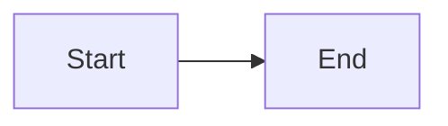

# Mermaid.js for Data Flows & AWS Architecture — Comprehensive Learning Guide

**Target Audience**: Engineers who need to create professional infrastructure diagrams and data flow visualizations using Mermaid.js
**Estimated Total Time**: 3-4 hours (10 modules, 15-25 min each)
**Mermaid Version**: v11.1.0+ (architecture-beta requires v11.1.0+; some features require v11.10.0+)

---

## Module 0: Foundations — What Mermaid Is and How It Renders

**Bloom Level**: Remember | **Scaffolding**: HIGH | **Prerequisites**: None
**Concepts**: Mermaid syntax basics, rendering environments, frontmatter configuration, built-in themes

### What Is Mermaid?

Mermaid is a JavaScript-based diagramming tool that renders text definitions into SVG diagrams. You write declarative text, and Mermaid produces visual output. No drag-and-drop, no image editing — just text that lives alongside your code.

### Where Mermaid Renders

| Environment | Custom Icons? | Theming? | Interactive? |
|-------------|:---:|:---:|:---:|
| GitHub/GitLab Markdown | No | Limited | No |
| Mermaid Live Editor (mermaid.live) | Yes (with setup) | Yes | Yes |
| HTML pages (CDN/npm) | Yes | Yes | Yes |
| mmdc CLI (mermaid-cli) | Yes | Yes | No (static output) |
| VS Code (Markdown Preview Mermaid) | Partial | Partial | No |

**Key Insight**: GitHub/GitLab render Mermaid natively in markdown fences, but they strip custom icon registrations and advanced theming. For AWS architecture diagrams with icons, you need HTML or mmdc pre-rendering.

### Basic Syntax Pattern

Every Mermaid diagram starts with a keyword declaring the diagram type:

````markdown

````

### Frontmatter Configuration

Place YAML frontmatter before the diagram keyword to configure rendering:

```
---
config:
  theme: base
  themeVariables:
    primaryColor: "#4285f4"
    primaryTextColor: "#ffffff"
---
flowchart LR
    A[Start] --> B[End]
```

### Legacy Directive Syntax

Directives (deprecated since v10.5.0, but still widely used):

```
%%{init: { "theme": "dark", "fontFamily": "monospace" } }%%
flowchart LR
    A[Start] --> B[End]
```

### Built-in Themes

| Theme | Description | Best For |
|-------|-------------|----------|
| `default` | Blue/gray tones | General use |
| `neutral` | Black and white | Printing, documentation |
| `dark` | Dark background | Dark-mode UIs |
| `forest` | Green palette | Nature-themed |
| `base` | **Only customizable theme** — plain starting point | Custom branding |

**Rule**: If you need custom colors, you must use the `base` theme. Other themes ignore `themeVariables`.

### Accessibility

Add accessible titles and descriptions to any diagram:

```
flowchart LR
    accTitle: Data flow from user to database
    accDescr: Shows the path of user requests through the API to PostgreSQL
    A[User] --> B[API] --> C[(Database)]
```

These generate `<title>` and `<desc>` elements in the SVG for screen readers.

### Try It Yourself

1. Go to [mermaid.live](https://mermaid.live)
2. Paste this and verify it renders:
```
flowchart TD
    A[Browser] --> B[Server]
    B --> C[(Database)]
```
3. Change `TD` to `LR` — what happens?
4. Add `%%{init: {"theme": "dark"}}%%` before `flowchart` — what changes?

---

## Module 1: Flowcharts for Data Flows — Shapes, Edges, and Direction

**Bloom Level**: Remember | **Scaffolding**: HIGH | **Prerequisites**: [0]
**Concepts**: Direction control, node shapes, edge types, edge labels

### Direction Control

The keyword after `flowchart` sets the primary direction:

| Keyword | Direction | Best For |
|---------|-----------|----------|
| `TB` or `TD` | Top → Bottom | Hierarchical flows, org charts |
| `BT` | Bottom → Top | Build-up diagrams |
| `LR` | Left → Right | Data pipelines, timelines |
| `RL` | Right → Left | Reverse flows |

**For data flows, `LR` (Left to Right) is the most natural choice** — it reads like a pipeline.

### Node Shapes

Shapes communicate what kind of component a node represents:

```
flowchart LR
    rect[Rectangle - Process/Service]
    round(Rounded - Generic Step)
    stadium([Stadium - Terminal/IO])
    cyl[(Cylinder - Database)]
    circle((Circle - Event/Signal))
    diamond{Diamond - Decision}
    hex{{Hexagon - Preparation}}
    para[/Parallelogram - Input/]
    trap[\Trapezoid - Output\]
    dblcirc(((Double Circle - Critical)))
```

**For AWS architecture, the most useful shapes are:**
- `[(Cylinder)]` for databases (RDS, DynamoDB, pgvector)
- `[Rectangle]` for services (ECS, EC2, Lambda)
- `((Circle))` for events (EventBridge, S3 notifications)
- `{Diamond}` for decisions/routing (ALB rules)
- `([Stadium])` for external services (Azure OpenAI, Neo4j)

### Edge Types

Edges connect nodes and indicate data flow direction and nature:

```
flowchart LR
    A -->|"solid arrow"| B
    C ---|"solid line (no arrow)"| D
    E -.->|"dotted arrow"| F
    G ==>|"thick arrow"| H
    I --o|"circle end"| J
    K --x|"cross end (error)"| L
```

| Syntax | Visual | Use For |
|--------|--------|---------|
| `-->` | Solid arrow | Normal data flow |
| `---` | Solid line | Association/reference |
| `-.->` | Dotted arrow | Async/eventual flow |
| `==>` | Thick arrow | Primary/critical path |
| `--o` | Circle endpoint | Read/query operation |
| `--x` | Cross endpoint | Error/rejection path |

### Edge Labels

Add text to edges to describe the data flowing through:

```
flowchart LR
    User -->|HTTP POST| API
    API -->|SQL INSERT| DB[(PostgreSQL)]
    API -.->|async| Queue([SQS])
```

### Controlling Edge Length

More dashes = longer edge (adds spacing):

```
flowchart LR
    A --> B
    A ----> C
    A ------> D
```

### Complete Data Flow Example

```
flowchart LR
    User[User Browser]
    API[FastAPI Service]
    DB[(PostgreSQL)]
    S3([S3 Bucket])
    Queue([SQS Queue])

    User -->|"upload file"| API
    API -->|"store metadata"| DB
    API -->|"upload binary"| S3
    S3 -.->|"S3 event"| Queue
    Queue -.->|"trigger"| Worker[Lambda Worker]
    Worker -->|"process"| DB
```

### Try It Yourself

Recreate this data flow in mermaid.live:
- A user sends a request to an API Gateway
- API Gateway routes to a Lambda function
- Lambda reads from DynamoDB and writes to S3
- Use appropriate shapes for each component
- Label the edges with the operation type

---

## Module 2: Flowcharts — Subgraphs, Styling, and Complex Layouts

**Bloom Level**: Understand | **Scaffolding**: HIGH | **Prerequisites**: [0, 1]
**Concepts**: Subgraphs, classDef styling, linkStyle, nested subgraphs, curve types

### Subgraphs — Visual Grouping

Subgraphs create labeled boundaries around related nodes (like VPCs, availability zones, or service groups):

```
flowchart TB
    subgraph VPC["VPC (10.0.0.0/16)"]
        subgraph PublicSubnet["Public Subnet"]
            ALB[Application Load Balancer]
        end
        subgraph PrivateSubnet["Private Subnet"]
            ECS[ECS Fargate]
            RDS[(RDS PostgreSQL)]
        end
        ALB --> ECS
        ECS --> RDS
    end
    Internet((Internet)) --> ALB
```

**Rules:**
- Subgraphs can be nested to any depth
- Each subgraph can have its own `direction` (but parent direction overrides if nodes connect outside)
- Edges can connect to subgraph boundaries: `Internet --> VPC` treats the subgraph as a node

### Subgraph Direction Override

```
flowchart LR
    subgraph Pipeline["Data Pipeline"]
        direction TB
        Ingest[Ingest] --> Transform[Transform] --> Load[Load]
    end
    Source([S3]) --> Pipeline
    Pipeline --> Target[(DynamoDB)]
```

### Styling with classDef

Define reusable style classes and apply them to nodes:

```
flowchart LR
    classDef aws fill:#FF9900,stroke:#232F3E,color:#232F3E
    classDef database fill:#3B48CC,stroke:#232F3E,color:#fff
    classDef external fill:#6B7280,stroke:#374151,color:#fff

    S3:::aws
    Lambda:::aws
    RDS:::database
    Neo4j:::external

    S3([S3 Bucket]) --> Lambda[Lambda Function]
    Lambda --> RDS[(RDS)]
    Lambda --> Neo4j([Neo4j])
```

**Apply inline with `:::`:**
```
A[Service]:::aws --> B[(Database)]:::database
```

**Apply via class statement:**
```
class A,B,C aws
```

### Styling Individual Nodes

```
flowchart LR
    A[Critical Service]
    style A fill:#ff0000,stroke:#990000,color:#fff,stroke-width:3px
```

**Available style properties:**
- `fill` — Background color (hex only)
- `stroke` — Border color
- `stroke-width` — Border thickness
- `color` — Text color
- `stroke-dasharray` — Dashed border (`5 5` for dashes)

### Styling Edges with linkStyle

Edges are styled by their index (0-based, in order of appearance):

```
flowchart LR
    A --> B
    B --> C
    C --> D

    linkStyle 0 stroke:#ff0000,stroke-width:3px
    linkStyle 1 stroke:#00ff00,stroke-width:2px
    linkStyle default stroke:#999,stroke-width:1px
```

### Edge Animation (v11.10.0+)

Assign IDs to edges and animate them:

```
flowchart LR
    e1@{ animate: true }

    A -- e1 --> B
```

### Curve Types

Control how edges curve between nodes by adding to frontmatter:

```
---
config:
  flowchart:
    curve: basis
---
```

| Curve | Visual | Best For |
|-------|--------|----------|
| `basis` | Smooth curves | Aesthetic diagrams |
| `linear` | Straight lines | Technical diagrams |
| `step` | Right-angle steps | Circuit/flow diagrams |
| `stepAfter` | Step after node | Sequential processes |
| `cardinal` | Smooth through points | Organic flows |
| `monotoneX` | Monotone horizontal | LR data flows |

### Complete Styled AWS Example

```
flowchart TB
    classDef compute fill:#FF9900,stroke:#232F3E,color:#232F3E,stroke-width:2px
    classDef storage fill:#3B48CC,stroke:#232F3E,color:#fff,stroke-width:2px
    classDef network fill:#8C4FFF,stroke:#232F3E,color:#fff,stroke-width:2px
    classDef event fill:#E7157B,stroke:#232F3E,color:#fff,stroke-width:2px

    subgraph VPC["VPC"]
        subgraph Public["Public Subnet"]
            ALB[ALB]:::network
        end
        subgraph Private["Private Subnet"]
            ECS[ECS Fargate<br/>ai-api]:::compute
            Lambda[Lambda<br/>workers]:::compute
        end
    end

    Internet((Internet)) -->|HTTP:80| ALB
    ALB -->|"/ai-api/*"| ECS
    ECS -->|invoke| Lambda
    ECS --> RDS[(RDS<br/>pgvector)]:::storage
    ECS --> DDB[(DynamoDB)]:::storage
    Lambda --> S3([S3 Bucket]):::storage
    S3 -.->|event| EB((EventBridge)):::event
    EB -.->|trigger| Lambda
```

### Try It Yourself

Take the example above and:
1. Add a Neo4j node with `external` styling (gray)
2. Connect Lambda to Neo4j with a dotted arrow labeled "write graph"
3. Add a subgraph around RDS and DDB called "Data Layer"
4. Change the curve type to `step` — which looks better for architecture?

---

## Module 3: Architecture Diagrams (architecture-beta) — AWS Infrastructure

**Bloom Level**: Understand | **Scaffolding**: HIGH | **Prerequisites**: [0, 1]
**Concepts**: architecture-beta syntax, groups, services, edges, junctions, built-in icons

### What Is architecture-beta?

Introduced in Mermaid v11.1.0, `architecture-beta` is purpose-built for cloud and infrastructure diagrams. Unlike flowcharts (which are general-purpose), architecture diagrams use:
- **Groups** for logical containers (VPCs, subnets, regions)
- **Services** for infrastructure components (databases, compute, storage)
- **Edges** with directional routing (T/B/L/R — top/bottom/left/right)
- **Junctions** for splitting edges four ways

### Basic Syntax

```
architecture-beta
    group api(cloud)[API Layer]

    service server(server)[Web Server] in api
    service db(database)[Database] in api
    service store(disk)[Storage] in api

    server:R --> L:db
    server:B --> T:store
```

### Groups — Containers for Related Services

```
group {id}({icon})[{label}]
group {id}({icon})[{label}] in {parent_id}
```

Groups define visual boundaries. They can be nested to represent VPCs containing subnets containing services:

```
architecture-beta
    group vpc(cloud)[VPC 10.0.0.0/16]
    group public(internet)[Public Subnet] in vpc
    group private(server)[Private Subnet] in vpc
    group data(database)[Data Layer] in vpc
```

### Services — Individual Components

```
service {id}({icon})[{label}]
service {id}({icon})[{label}] in {parent_id}
```

Services are the nodes inside groups:

```
architecture-beta
    group vpc(cloud)[VPC]

    service alb(internet)[ALB] in vpc
    service ecs(server)[ECS Fargate] in vpc
    service rds(database)[PostgreSQL RDS] in vpc
    service s3(disk)[S3 Bucket]

    alb:R --> L:ecs
    ecs:R --> L:rds
    ecs:B --> T:s3
```

### Built-in Icons

These icons work everywhere — no registration needed:

| Icon | Keyword | Use For |
|------|---------|---------|
| Cloud | `cloud` | VPCs, cloud regions, logical groups |
| Database | `database` | RDS, DynamoDB, any data store |
| Disk | `disk` | S3, EBS, file storage |
| Internet | `internet` | ALBs, API Gateways, public endpoints |
| Server | `server` | EC2, ECS, Lambda, compute services |

### Edges — Directional Connections

Edges in architecture diagrams specify which side of each service they connect to:

```
{source}:{side} {arrow} {side}:{target}
```

**Side codes**: `T` (top), `B` (bottom), `L` (left), `R` (right)

**Arrow types**:
- `-->` — Right-pointing arrow (flow direction)
- `<--` — Left-pointing arrow
- `<-->` — Bidirectional
- `--` — No arrow (association)

```
architecture-beta
    service a(server)[Service A]
    service b(server)[Service B]
    service c(database)[Database]

    a:R --> L:b
    b:B --> T:c
    a:B --> T:c
```

**Why side matters**: Unlike flowcharts, architecture diagrams give you precise control over edge routing. `a:R --> L:b` means the edge exits from the **right** side of A and enters the **left** side of B. This produces clean, non-overlapping layouts.

### Junctions — Four-Way Edge Splits

When one service connects to multiple others, use a junction to create clean branching:

```
architecture-beta
    service api(server)[API Server]
    service db(database)[Database]
    service cache(database)[Cache]
    service store(disk)[Storage]

    junction mid

    api:R --> L:mid
    mid:R --> L:db
    mid:T --> B:cache
    mid:B --> T:store
```

### Group-Level Edges

Edges can connect to group boundaries (not just services):

```
architecture-beta
    group frontend(internet)[Frontend]
    group backend(server)[Backend]

    service web(server)[Web App] in frontend
    service api(server)[API] in backend
    service db(database)[DB] in backend

    web:R --> L:api
    api:B --> T:db
```

### Complete AWS Architecture Example (Built-in Icons Only)

```
architecture-beta
    group vpc(cloud)[VPC - us-east-1]
    group public(internet)[Public Subnet] in vpc
    group private(server)[Private Subnet] in vpc
    group data(database)[Data Layer]

    service alb(internet)[ALB] in public
    service ecs(server)[ECS ai-api] in private
    service lambda(server)[Lambda Workers] in private
    service batch(server)[AWS Batch] in private
    service rds(database)[RDS pgvector] in data
    service dynamo(database)[DynamoDB] in data
    service s3(disk)[S3 lz-test]
    service bedrock(cloud)[Bedrock Claude]
    service neo4j(database)[Neo4j]

    alb:R --> L:ecs
    ecs:B --> T:rds
    ecs:R --> L:bedrock
    ecs:B --> T:dynamo
    lambda:B --> T:rds
    lambda:R --> L:s3
    batch:B --> T:neo4j
    batch:L --> R:s3
    s3:B --> T:lambda
```

### Try It Yourself

1. Paste the example above into mermaid.live — does it render?
2. Add an `internet` service called "Users" outside the VPC, connected to the ALB
3. Add a junction between ECS and the data layer so all data connections route through one point
4. Try nesting: move RDS and DynamoDB into a subgroup called "Databases" inside the data group

---

## Module 4: Architecture Diagrams — Custom Icons and AWS Icon Packs

**Bloom Level**: Apply | **Scaffolding**: MEDIUM | **Prerequisites**: [0, 3]
**Concepts**: Iconify integration, AWS icon registration, logos pack, aws-mermaid-icons, rendering limitations

### Why Custom Icons?

Built-in icons (`cloud`, `database`, `server`, `disk`, `internet`) work everywhere but are generic. For professional AWS diagrams, you want actual AWS service icons — the orange Lambda icon, the blue RDS icon, etc.

Mermaid supports 200,000+ icons from [Iconify](https://icones.js.org) via icon pack registration.

### Icon Registration (JavaScript Required)

Custom icons only work in environments where you can run JavaScript. This means **HTML pages**, **mermaid-cli (mmdc)**, or **Mermaid Live Editor with setup** — NOT raw GitHub/GitLab markdown.

#### Method 1: CDN (Simplest for HTML)

```javascript
import mermaid from 'https://cdn.jsdelivr.net/npm/mermaid@11/dist/mermaid.esm.min.mjs';

mermaid.registerIconPacks([
  {
    name: 'logos',
    loader: () =>
      fetch('https://unpkg.com/@iconify-json/logos@1/icons.json')
        .then((res) => res.json()),
  },
]);

mermaid.initialize({ startOnLoad: true });
```

The `logos` pack includes basic AWS icons:
- `logos:aws` — AWS logo
- `logos:aws-lambda` — Lambda
- `logos:aws-s3` — S3
- `logos:aws-dynamodb` — DynamoDB
- `logos:aws-ec2` — EC2
- `logos:aws-rds` — RDS
- `logos:aws-api-gateway` — API Gateway
- `logos:aws-aurora` — Aurora

Usage in diagram:
```
architecture-beta
    service lambda(logos:aws-lambda)[Lambda Function]
    service s3(logos:aws-s3)[S3 Bucket]
    service rds(logos:aws-rds)[RDS Database]

    lambda:R --> L:s3
    lambda:B --> T:rds
```

#### Method 2: Full AWS Icons (855+ Icons)

The [aws-mermaid-icons](https://github.com/harmalh/aws-mermaid-icons) project provides comprehensive AWS icon coverage:

```javascript
mermaid.registerIconPacks([
  {
    name: 'aws',
    loader: () =>
      fetch('https://raw.githubusercontent.com/harmalh/aws-mermaid-icons/main/iconify-json/aws-icons.json')
        .then((res) => res.json()),
  },
]);
```

Naming conventions:
- AWS-branded: `aws:aws-lambda`, `aws:aws-batch`, `aws:aws-fargate`
- Amazon-branded: `aws:amazon-rds`, `aws:amazon-dynamodb`, `aws:amazon-s3`, `aws:amazon-eventbridge`
- Resources: `aws:amazon-ec2-instance`, `aws:amazon-vpc`, `aws:amazon-cloudwatch`

#### Method 3: NPM Package (Build Systems)

```bash
npm install @iconify-json/logos
```

```javascript
import mermaid from 'mermaid';
import { icons } from '@iconify-json/logos';

mermaid.registerIconPacks([{ name: icons.prefix, icons }]);
mermaid.initialize({ startOnLoad: true });
```

### Complete HTML Template for AWS Diagrams

```html
<!DOCTYPE html>
<html>
<head>
  <style>
    body { font-family: Arial, sans-serif; padding: 20px; }
    .mermaid { max-width: 1200px; margin: 0 auto; }
  </style>
</head>
<body>
  <div class="mermaid">
    architecture-beta
      group vpc(cloud)[VPC us-east-1]
      group public(logos:aws-api-gateway)[Public Subnet] in vpc
      group private(logos:aws-fargate)[Private Subnet] in vpc

      service alb(logos:aws-api-gateway)[ALB] in public
      service ecs(logos:aws-ec2)[ECS Fargate] in private
      service lambda(logos:aws-lambda)[Lambda Workers] in private
      service rds(logos:aws-rds)[RDS pgvector]
      service dynamo(logos:aws-dynamodb)[DynamoDB]
      service s3(logos:aws-s3)[S3 Bucket]

      alb:R --> L:ecs
      ecs:B --> T:rds
      ecs:B --> T:dynamo
      lambda:R --> L:s3
  </div>

  <script type="module">
    import mermaid from 'https://cdn.jsdelivr.net/npm/mermaid@11/dist/mermaid.esm.min.mjs';
    mermaid.registerIconPacks([
      {
        name: 'logos',
        loader: () =>
          fetch('https://unpkg.com/@iconify-json/logos@1/icons.json')
            .then((res) => res.json()),
      },
    ]);
    mermaid.initialize({ startOnLoad: true, theme: 'default' });
  </script>
</body>
</html>
```

### Pre-rendering with mmdc CLI

For static output (SVG/PNG) that you can embed anywhere:

```bash
npm install -g @mermaid-js/mermaid-cli

# Render with icon packs
mmdc -i diagram.mmd -o diagram.svg --iconPacks @iconify-json/logos
mmdc -i diagram.mmd -o diagram.png --iconPacks @iconify-json/logos
```

### Critical Limitation: Static Markdown Renderers

**Custom icons DO NOT work in GitHub, GitLab, or any static markdown renderer.** Icons render as blue boxes with `?` symbols.

**Workarounds:**
1. Use built-in icons only (`cloud`, `database`, `server`, `disk`, `internet`) for markdown
2. Pre-render to SVG/PNG with mmdc, embed the image
3. Use HTML pages where you can register icon packs
4. Keep two versions: one with icons (HTML/SVG), one with built-in icons (markdown)

### Strategy: Dual-Mode Diagrams

For documentation that must work in both GitHub markdown AND rich environments:

**Markdown version** (built-in icons):
```
architecture-beta
    service lambda(server)[Lambda]
    service s3(disk)[S3]
    service rds(database)[RDS]
```

**HTML version** (AWS icons):
```
architecture-beta
    service lambda(logos:aws-lambda)[Lambda]
    service s3(logos:aws-s3)[S3]
    service rds(logos:aws-rds)[RDS]
```

### Try It Yourself

1. Create an HTML file using the template above
2. Open it in a browser — do the AWS icons render?
3. Try changing `logos:aws-lambda` to just `server` — note the difference
4. Add `logos:aws-dynamodb` for a DynamoDB service node
5. Try pasting the `logos:` version into GitHub markdown — confirm it doesn't render icons

---

## Module 5: Sequence Diagrams — Service-to-Service Communication

**Bloom Level**: Understand | **Scaffolding**: MEDIUM | **Prerequisites**: [0, 1]
**Concepts**: Participants, message types, activation, control flow (loop/alt/par), notes

### When to Use Sequence Diagrams

Use sequence diagrams when you need to show **the order of interactions** between services. While flowcharts show the structure, sequence diagrams show the conversation.

**Best for:**
- API request/response flows
- Multi-service orchestration (e.g., web-server → ALB → ai-api → Bedrock)
- Debugging timing issues
- Documenting async event chains

### Participants

Declare participants to control their order (left to right):

```
sequenceDiagram
    participant User
    participant WebApp as Web App
    participant API as Web Server (Hono)
    participant AIAPI as ECS ai-api
    participant DB as PostgreSQL
```

**Aliases**: `participant API as Web Server (Hono)` displays "Web Server (Hono)" but uses `API` in message syntax.

**Actor symbol**: Use `actor` instead of `participant` for stick-figure icons:
```
actor User
participant API as Web Server
```

### Message Arrow Types

| Arrow | Syntax | Meaning |
|-------|--------|---------|
| Solid with arrowhead | `->>` | Synchronous request |
| Dotted with arrowhead | `-->>` | Response / async reply |
| Solid no arrowhead | `->` | Simple message |
| Dotted no arrowhead | `-->` | Return / callback |
| Solid cross | `-x` | Failed/rejected message |
| Dotted cross | `--x` | Failed async response |
| Bidirectional | `<<->>` | Two-way communication (v11.0.0+) |

### Activation — Show When Services Are Active

Activation bars show when a service is processing a request:

```
sequenceDiagram
    participant User
    participant API
    participant DB

    User ->>+ API: POST /upload
    API ->>+ DB: INSERT file metadata
    DB -->>- API: OK
    API -->>- User: 201 Created
```

`+` activates (starts the bar), `-` deactivates (ends the bar).

### Control Flow Blocks

#### loop — Repeated Operations

```
sequenceDiagram
    participant Worker
    participant S3
    participant Bedrock

    Worker ->> S3: Get document chunks

    loop For each chunk
        Worker ->> Bedrock: Generate embedding
        Bedrock -->> Worker: Vector [1536 dims]
    end

    Worker ->> DB: Batch INSERT vectors
```

#### alt/else — Conditional Paths

```
sequenceDiagram
    participant API
    participant Cache
    participant DB

    API ->> Cache: GET key
    alt Cache hit
        Cache -->> API: Cached result
    else Cache miss
        API ->> DB: SELECT query
        DB -->> API: Result
        API ->> Cache: SET key
    end
```

#### par/and — Parallel Operations

```
sequenceDiagram
    participant WebServer
    participant S3
    participant DB
    participant DynamoDB

    WebServer ->> WebServer: Process upload

    par Upload file
        WebServer ->> S3: PUT object
    and Save metadata
        WebServer ->> DB: INSERT metadata
    and Track job
        WebServer ->> DynamoDB: PUT item
    end

    WebServer -->> User: Upload complete
```

#### critical/option — Must-succeed with fallback

```
sequenceDiagram
    participant API
    participant Bedrock
    participant Azure as Azure OpenAI

    critical LLM Inference
        API ->> Bedrock: InvokeModel (Claude)
        Bedrock -->> API: Response
    option Bedrock unavailable
        API ->> Azure: Chat Completion
        Azure -->> API: Response
    end
```

### Notes

Add contextual notes to the diagram:

```
sequenceDiagram
    participant API
    participant Bedrock

    Note over API: Validates API key first
    API ->> Bedrock: InvokeModel
    Note right of Bedrock: Claude 3.7 Sonnet
    Bedrock -->> API: Response
    Note over API,Bedrock: ~2-5 second latency
```

### Complete Example: AI Agent RAG Flow

```
sequenceDiagram
    actor User
    participant App as Web App (React)
    participant WS as Web Server (Hono)
    participant ALB
    participant AI as ECS ai-api (FastAPI)
    participant PG as PostgreSQL + pgvector
    participant Bedrock as Bedrock Claude
    participant DDB as DynamoDB
    participant S3

    User ->>+ App: Ask question
    App ->>+ WS: POST /api/chat
    WS ->>+ ALB: POST /ai-api/agents/hclm-agent
    Note right of WS: X-API-Key header auth
    ALB ->>+ AI: Route to ECS

    AI ->>+ PG: Load LangGraph checkpoint
    PG -->>- AI: Previous state

    AI ->>+ PG: Semantic search (pgvector)
    PG -->>- AI: Relevant documents

    AI ->>+ S3: Fetch full documents
    S3 -->>- AI: Document content

    AI ->>+ Bedrock: InvokeModel (Claude 3.7)
    Note right of Bedrock: Prompt + context + documents
    Bedrock -->>- AI: LLM response

    AI ->>+ PG: Save LangGraph checkpoint
    PG -->>- AI: Saved

    AI ->>+ DDB: Update job status
    DDB -->>- AI: OK

    AI -->>- ALB: JSON response
    ALB -->>- WS: Response
    WS -->>- App: Response
    App -->>- User: Display answer
```

### Try It Yourself

Create a sequence diagram for the **File Upload Pipeline**:
1. User uploads a file through Web App
2. Web App sends it to Web Server
3. Web Server uploads to S3, saves metadata to PostgreSQL, and tracks in DynamoDB (in parallel)
4. Web Server forwards to file-upload-server
5. file-upload-server chunks the document, generates embeddings via Bedrock Titan, stores in pgvector
6. file-upload-server creates a graph node in Neo4j

Use `par` for the parallel operations and `loop` for the chunking/embedding step.

---

## Module 6: C4 Diagrams — Enterprise Architecture Modeling

**Bloom Level**: Apply | **Scaffolding**: MEDIUM | **Prerequisites**: [0, 1, 3]
**Concepts**: C4 model levels, C4Context, C4Container, C4Component, relationships, boundaries

### The C4 Model

C4 (Context, Container, Component, Code) is a hierarchical approach to software architecture documentation. Mermaid supports it as an **experimental** feature — syntax may change.

| Level | Shows | Audience |
|-------|-------|----------|
| **Context** | System + external actors | Everyone |
| **Container** | Applications, databases, services | Technical leads |
| **Component** | Internal modules/classes | Developers |
| **Deployment** | Infrastructure nodes | DevOps/SRE |

### C4Context — High-Level System View

```
C4Context
    title Transformation XPLR - System Context

    Person(user, "Business Analyst", "Uses platform for transformation analysis")
    Person(admin, "Admin", "Manages system configuration")

    System(txplr, "Transformation XPLR", "AI-powered business transformation platform")

    System_Ext(azure, "Azure OpenAI", "LLM inference")
    System_Ext(bedrock, "AWS Bedrock", "Claude + Titan embeddings")
    System_Ext(neo4j, "Neo4j", "Graph database")

    Rel(user, txplr, "Uses", "HTTPS")
    Rel(admin, txplr, "Manages", "HTTPS")
    Rel(txplr, azure, "Calls", "HTTPS")
    Rel(txplr, bedrock, "Calls", "AWS SDK")
    Rel(txplr, neo4j, "Writes", "Bolt")
```

### C4Container — Application Architecture

```
C4Container
    title Transformation XPLR - Container Diagram

    Person(user, "User", "Business analyst")

    System_Boundary(txplr, "Transformation XPLR") {
        Container(webapp, "Web App", "React 19, Vite", "User-facing SPA")
        Container(webserver, "Web Server", "Hono, Node.js", "Backend orchestrator")
        Container(aiapi, "AI API", "FastAPI, LangGraph", "AI agent service")
        Container(fileserver, "File Upload Server", "FastAPI, Python", "Document processing")
        Container(lambdas, "Lambda Functions", "Python", "Serverless workers")

        ContainerDb(rds, "PostgreSQL + pgvector", "RDS", "Relational + vector data")
        ContainerDb(dynamo, "DynamoDB", "AWS", "Job status tracking")
        ContainerQueue(batch, "AWS Batch", "Fargate", "Background job processing")
        Container(s3, "S3 Bucket", "AWS", "Document storage")
    }

    System_Ext(bedrock, "Bedrock", "Claude 3.7 + Titan Embed")
    System_Ext(neo4j, "Neo4j", "Graph database")

    Rel(user, webapp, "Uses", "HTTPS")
    Rel(webapp, webserver, "API calls", "HTTP")
    Rel(webserver, aiapi, "Via ALB", "HTTP /ai-api/*")
    Rel(webserver, fileserver, "Upload", "HTTP")
    Rel(webserver, batch, "Submits jobs", "AWS SDK")
    Rel(aiapi, rds, "Read/Write", "SQL")
    Rel(aiapi, bedrock, "Invoke", "AWS SDK")
    Rel(aiapi, dynamo, "Track jobs", "AWS SDK")
    Rel(fileserver, s3, "Upload", "boto3")
    Rel(fileserver, rds, "Store vectors", "pgvector")
    Rel(fileserver, neo4j, "Write graph", "Bolt")
    Rel(lambdas, batch, "Submit", "AWS SDK")
    Rel(lambdas, s3, "Read/Write", "boto3")
```

### C4Deployment — Infrastructure View

```
C4Deployment
    title Transformation XPLR - Deployment (Test Environment)

    Deployment_Node(aws, "AWS Account 002573266251", "us-east-1") {
        Deployment_Node(vpc, "VPC", "10.0.0.0/16") {
            Deployment_Node(pub, "Public Subnet") {
                Container(alb, "ALB", "HTTP:80", "Internet-facing load balancer")
            }
            Deployment_Node(priv, "ECS Cluster", "Fargate") {
                Container(aiapi, "ai-api", "2 vCPU / 4 GB", "FastAPI + LangGraph")
                Container(adminui, "admin-ui", "0.5 vCPU / 1 GB", "React SPA")
            }
        }
        Deployment_Node(ec2, "EC2 Instance", "r6i.xlarge via SSM") {
            Container(webserver, "web-server", "Port 8000", "Hono/Node.js")
            Container(fileserver, "file-upload-server", "Port 8001", "FastAPI/Python")
            Container(webapp, "web-app", "Port 3000", "React 19 SPA")
        }
        Deployment_Node(serverless, "Serverless") {
            Container(lambda, "Lambda Functions", "Python 3.11", "11 functions")
            Container(batch, "AWS Batch", "Fargate", "2 job definitions")
        }
        Deployment_Node(data, "Data Services") {
            ContainerDb(rds, "RDS PostgreSQL", "db.t4g.micro", "pgvector enabled")
            ContainerDb(dynamo, "DynamoDB", "PAY_PER_REQUEST", "33 tables")
            Container(s3, "S3", "SSE-S3", "transformation-xplr-lz-test")
        }
    }

    Deployment_Node(ext, "External") {
        Container(neo4j, "Neo4j", "Public IP", "bolt://44.217.116.230")
        Container(azure, "Azure OpenAI", "HTTPS", "LLM + Embeddings")
    }

    Rel(alb, aiapi, "Routes /ai-api/*", "HTTP:8000")
    Rel(alb, adminui, "Routes /*", "HTTP:80")
    Rel(webserver, alb, "Calls", "HTTP")
    Rel(aiapi, rds, "SQL", "5432")
    Rel(aiapi, dynamo, "SDK", "HTTPS")
    Rel(fileserver, neo4j, "Write", "Bolt:7687")
```

### Styling C4 Elements

```
UpdateElementStyle(aiapi, $bgColor="#FF9900", $fontColor="white")
UpdateRelStyle(user, webapp, $textColor="#333", $lineColor="#666", $offsetX="-40")
UpdateLayoutConfig($c4ShapeInRow="3", $c4BoundaryInRow="2")
```

### Limitations of C4 in Mermaid

- **Experimental** — syntax may change in future versions
- No automatic layout algorithm — position determined by statement order
- Sprites, tags, links, and legends not supported
- Layout direction control not available
- Offset positioning (`$offsetX`, `$offsetY`) needed for label placement

### Try It Yourself

Create a C4Container diagram for just the **File Upload Pipeline**:
1. Show the User, Web App, Web Server, File Upload Server as containers
2. Show S3, PostgreSQL+pgvector, Neo4j as container databases
3. Show Bedrock as an external system
4. Draw relationships showing the upload flow with appropriate labels

---

## Module 7: Block Diagrams and Supporting Types

**Bloom Level**: Apply | **Scaffolding**: MEDIUM | **Prerequisites**: [0, 1]
**Concepts**: Block diagrams, ER diagrams, state diagrams, Sankey diagrams

### Block Diagrams — Manual Layout Control

Block diagrams give you explicit control over grid-based positioning. Unlike flowcharts (auto-layout), you define the number of columns and how blocks span them.

```
block-beta
    columns 3

    Internet["Internet"]:3
    space
    ALB["ALB (HTTP:80)"]
    space

    space
    subgraph ECS["ECS Cluster"]
        columns 2
        aiapi["ai-api<br/>Port 8000"]
        adminui["admin-ui<br/>Port 80"]
    end
    space

    RDS[("PostgreSQL<br/>pgvector")]
    DynamoDB[("DynamoDB<br/>33 tables")]
    S3[("S3<br/>lz-test")]

    Internet --> ALB
    ALB --> aiapi
    ALB --> adminui
    aiapi --> RDS
    aiapi --> DynamoDB
    aiapi --> S3
```

**Key features:**
- `columns N` — Sets grid width
- `:N` after block — Spans N columns
- `space` — Empty cell for spacing
- Subgraphs for nested grids
- All standard shapes: `()`, `[]`, `[()]`, `(())`, `{}`, `{{}}`

### ER Diagrams — Database Schema Documentation

Use entity relationship diagrams to document your database schema:

```
erDiagram
    CLIENT ||--o{ PROJECT : "has many"
    PROJECT ||--o{ FILE : "contains"
    FILE ||--o{ EMBEDDING : "generates"
    FILE ||--o| CLIENT_FILE_NODE : "maps to"

    CLIENT {
        uuid id PK
        string name
        string industry
        timestamp created_at
    }

    PROJECT {
        uuid id PK
        uuid client_id FK
        string name
        jsonb settings
    }

    FILE {
        uuid id PK
        uuid project_id FK
        string s3_key
        string content_type
        int size_bytes
        timestamp uploaded_at
    }

    EMBEDDING {
        uuid id PK
        uuid file_id FK
        string collection_name
        vector embedding "1536 dims"
        text content
        jsonb metadata
    }

    CLIENT_FILE_NODE {
        string neo4j_id PK
        uuid file_id FK
        uuid client_id FK
        string relationship "BELONGS_TO"
    }
```

**Cardinality notation (Crow's Foot):**

| Left | Right | Meaning |
|------|-------|---------|
| `\|\|` | `\|\|` | Exactly one |
| `\|o` | `o\|` | Zero or one |
| `}\|` | `\|{` | One or more |
| `}o` | `o{` | Zero or more |

**Line types:**
- `--` (solid) — Identifying relationship
- `..` (dashed) — Non-identifying relationship

### State Diagrams — Workflow States

Document job/task lifecycle with state diagrams:

```
stateDiagram-v2
    [*] --> Pending: Job submitted
    Pending --> Processing: Worker picks up
    Processing --> Embedding: Chunking complete

    state Embedding {
        [*] --> Chunking
        Chunking --> Vectorizing
        Vectorizing --> Storing
        Storing --> [*]
    }

    Embedding --> Completed: All vectors stored
    Embedding --> Failed: Error during processing

    Failed --> Pending: Retry
    Completed --> [*]

    note right of Processing: Tracked in DynamoDB\nworkers-job-status table
    note left of Failed: Max 3 retries\nthen permanent failure
```

### Sankey Diagrams — Flow Volume Visualization

Show relative volume of data/requests flowing through your system:

```
sankey-beta

User Requests,Web Server,1000
Web Server,AI API (via ALB),600
Web Server,File Upload Server,300
Web Server,AWS Batch,100
AI API (via ALB),Bedrock Claude,500
AI API (via ALB),pgvector Search,400
AI API (via ALB),DynamoDB,600
File Upload Server,S3 Upload,300
File Upload Server,Bedrock Titan (Embeddings),250
File Upload Server,pgvector Store,250
File Upload Server,Neo4j,200
AWS Batch,S3 Read,100
AWS Batch,Bedrock,80
AWS Batch,Neo4j Write,60
```

### Try It Yourself

Create an ER diagram for the DynamoDB tables in this system:
1. A `Job` entity with pk, sk, status, created_at
2. A `Session` entity with pk, sk, user_id
3. A `Message` entity with pk, sk, content, timestamp
4. Show that Sessions have many Messages and may have many Jobs
5. Add appropriate attributes and cardinality

---

## Module 8: Theming and Professional Styling

**Bloom Level**: Apply | **Scaffolding**: MEDIUM | **Prerequisites**: [0, 1, 2]
**Concepts**: Base theme customization, themeVariables, diagram-specific variables, hex color requirement, ELK renderer

### Custom Theming Fundamentals

**Critical rule**: Only the `base` theme supports customization. All other themes ignore `themeVariables`.

**Critical rule**: Only hex colors work. `red`, `blue`, `green` — none work. Use `#ff0000`, `#0000ff`, `#00ff00`.

### Core Theme Variables

```
---
config:
  theme: base
  themeVariables:
    primaryColor: "#FF9900"
    primaryBorderColor: "#232F3E"
    primaryTextColor: "#232F3E"
    secondaryColor: "#3B48CC"
    tertiaryColor: "#E7157B"
    lineColor: "#5E5E5E"
    background: "#ffffff"
    fontFamily: "Arial, sans-serif"
    fontSize: "14px"
---
flowchart LR
    A[Service A] --> B[Service B] --> C[(Database)]
```

| Variable | Controls | Example |
|----------|----------|---------|
| `primaryColor` | Main node background | `#FF9900` (AWS orange) |
| `primaryBorderColor` | Main node border | `#232F3E` (AWS dark) |
| `primaryTextColor` | Main node text | `#232F3E` |
| `secondaryColor` | Alternate nodes | `#3B48CC` |
| `tertiaryColor` | Third-level nodes | `#E7157B` |
| `lineColor` | Edge/arrow color | `#5E5E5E` |
| `background` | Diagram background | `#ffffff` |
| `fontFamily` | Font stack | `Arial, sans-serif` |
| `fontSize` | Base text size | `14px` |

### AWS-Branded Theme Preset

```
---
config:
  theme: base
  themeVariables:
    primaryColor: "#FF9900"
    primaryBorderColor: "#232F3E"
    primaryTextColor: "#232F3E"
    secondaryColor: "#232F3E"
    secondaryBorderColor: "#FF9900"
    secondaryTextColor: "#ffffff"
    tertiaryColor: "#f0f0f0"
    tertiaryBorderColor: "#cccccc"
    tertiaryTextColor: "#333333"
    lineColor: "#232F3E"
    textColor: "#232F3E"
    background: "#ffffff"
    mainBkg: "#FF9900"
    nodeBorder: "#232F3E"
    clusterBkg: "#f5f5f5"
    clusterBorder: "#232F3E"
    titleColor: "#232F3E"
    edgeLabelBackground: "#ffffff"
---
```

### Diagram-Specific Variables

**Flowcharts:**
- `nodeBorder` — Node border color
- `clusterBkg` — Subgraph background
- `clusterBorder` — Subgraph border
- `defaultLinkColor` — Default edge color
- `titleColor` — Diagram title color
- `nodeTextColor` — Node text color

**Sequence Diagrams:**
- `actorBkg` — Participant box background
- `actorBorder` — Participant box border
- `signalColor` — Message arrow color
- `activationBkgColor` — Activation bar color
- `sequenceNumberColor` — Step number color

### Color-Coded AWS Service Classes

A practical pattern for consistent AWS diagrams:

```
flowchart TB
    %% AWS Service Color Palette
    classDef compute fill:#FF9900,stroke:#232F3E,color:#232F3E,stroke-width:2px
    classDef storage fill:#3B48CC,stroke:#232F3E,color:#ffffff,stroke-width:2px
    classDef database fill:#2E73B8,stroke:#232F3E,color:#ffffff,stroke-width:2px
    classDef network fill:#8C4FFF,stroke:#232F3E,color:#ffffff,stroke-width:2px
    classDef security fill:#DD344C,stroke:#232F3E,color:#ffffff,stroke-width:2px
    classDef ai fill:#01A88D,stroke:#232F3E,color:#ffffff,stroke-width:2px
    classDef event fill:#E7157B,stroke:#232F3E,color:#ffffff,stroke-width:2px
    classDef external fill:#6B7280,stroke:#374151,color:#ffffff,stroke-width:2px

    ECS[ECS Fargate]:::compute
    Lambda[Lambda]:::compute
    Batch[AWS Batch]:::compute
    S3([S3]):::storage
    RDS[(RDS pgvector)]:::database
    DDB[(DynamoDB)]:::database
    ALB{ALB}:::network
    Bedrock([Bedrock Claude]):::ai
    EB((EventBridge)):::event
    Neo4j([Neo4j]):::external

    ALB --> ECS
    ECS --> RDS
    ECS --> DDB
    ECS --> Bedrock
    Lambda --> S3
    S3 --> EB
    EB --> Lambda
    Batch --> Neo4j
```

### ELK Renderer for Complex Diagrams

For large diagrams with many nodes, the default layout engine may produce overlapping edges. The ELK (Eclipse Layout Kernel) renderer provides better automatic layout:

```
---
config:
  layout: elk
  elk:
    mergeEdges: true
    nodePlacementStrategy: SIMPLE
---
flowchart TB
    %% Complex diagram that benefits from ELK layout
    A --> B & C & D
    B --> E & F
    C --> F & G
    D --> G & H
```

**When to use ELK:**
- Diagrams with 15+ nodes
- Many crossing edges
- Complex subgraph arrangements
- Auto-layout preferred over manual edge routing

### Try It Yourself

1. Take the AWS-branded theme preset and apply it to a flowchart with 5 AWS services
2. Create the color-coded classDefs for compute, storage, database, network, AI
3. Apply appropriate classes to each service
4. Try both `linear` and `step` curves — which reads better?
5. Compare default renderer vs ELK on a diagram with 10+ nodes

---

## Module 9: AWS Architecture Patterns — Real-World Recipes

**Bloom Level**: Analyze | **Scaffolding**: LOW | **Prerequisites**: [0, 1, 2, 3, 5]
**Concepts**: Multi-service architectures, event-driven patterns, data pipeline flows, microservice communication

This module provides ready-to-use patterns for common AWS architectures. Each pattern is a complete, working diagram.

### Pattern 1: VPC with Public/Private Subnets + ALB

```
flowchart TB
    classDef network fill:#8C4FFF,stroke:#232F3E,color:#fff
    classDef compute fill:#FF9900,stroke:#232F3E,color:#232F3E
    classDef data fill:#2E73B8,stroke:#232F3E,color:#fff

    Internet((Internet))

    subgraph VPC["VPC 10.0.0.0/16"]
        subgraph PublicSubnet["Public Subnet (10.0.0.0/24, 10.0.1.0/24)"]
            ALB[ALB<br/>HTTP:80]:::network
        end

        subgraph PrivateSubnet["Private Subnet"]
            ECS1[ai-api<br/>2 vCPU / 4 GB]:::compute
            ECS2[admin-ui<br/>0.5 vCPU / 1 GB]:::compute
        end

        subgraph DataSubnet["Data Layer"]
            RDS[(RDS PostgreSQL<br/>pgvector)]:::data
            DDB[(DynamoDB<br/>33 tables)]:::data
        end
    end

    Internet -->|HTTP:80| ALB
    ALB -->|"/ai-api/*"| ECS1
    ALB -->|"/* (default)"| ECS2
    ECS1 --> RDS
    ECS1 --> DDB
```

### Pattern 2: Event-Driven Lambda Pipeline

```
flowchart LR
    classDef storage fill:#3B48CC,stroke:#232F3E,color:#fff
    classDef event fill:#E7157B,stroke:#232F3E,color:#fff
    classDef compute fill:#FF9900,stroke:#232F3E,color:#232F3E
    classDef data fill:#2E73B8,stroke:#232F3E,color:#fff

    S3([S3 Bucket]):::storage

    subgraph EventDriven["EventBridge Rules"]
        EB1((S3 ObjectCreated)):::event
        EB2((.pptx uploaded)):::event
        EB3((.jsonl uploaded)):::event
    end

    subgraph Lambdas["Lambda Functions"]
        L1[embeddings-<br/>producer-trigger]:::compute
        L2[pptx-to-pdf]:::compute
        L3[embeddings-<br/>ingestor-trigger]:::compute
    end

    subgraph Targets["Processing Targets"]
        Batch[AWS Batch<br/>embedding job]:::compute
        S3Out([S3 PDF output]):::storage
        Fargate[ECS Fargate<br/>vectorizer]:::compute
    end

    S3 -.-> EB1 & EB2 & EB3
    EB1 -.-> L1
    EB2 -.-> L2
    EB3 -.-> L3
    L1 -->|submit job| Batch
    L2 -->|"LibreOffice convert"| S3Out
    L3 -->|"start task"| Fargate
```

### Pattern 3: Full Data Pipeline (File Upload to Vector Storage)

```
sequenceDiagram
    actor User
    participant App as Web App
    participant WS as Web Server
    participant FUS as File Upload Server
    participant S3
    participant PG as PostgreSQL + pgvector
    participant BR as Bedrock Titan Embed
    participant Neo as Neo4j
    participant DDB as DynamoDB

    User ->>+ App: Upload file
    App ->>+ WS: POST /api/files/upload

    par Store metadata
        WS ->>+ PG: INSERT file record
        PG -->>- WS: file_id
    and Upload to S3
        WS ->>+ S3: PUT object
        Note right of S3: {prefix}/{companyId}/{projectId}/knowledgebase/...
        S3 -->>- WS: ETag
    and Track job
        WS ->>+ DDB: PUT item (job-status: PENDING)
        DDB -->>- WS: OK
    end

    WS ->>+ FUS: POST /upload (forward file)
    FUS ->>+ S3: PUT object (boto3)
    S3 -->>- FUS: OK

    FUS ->> FUS: Chunk document (RecursiveCharacterTextSplitter)

    loop For each chunk (with exponential backoff)
        FUS ->>+ BR: InvokeModel (Titan Embed v2)
        BR -->>- FUS: Vector [1536 dims]
    end

    FUS ->>+ PG: Batch INSERT into langchain_pg_embedding
    PG -->>- FUS: Stored

    FUS ->>+ Neo: CREATE (ClientFile)-[:BELONGS_TO]->(Client)
    Neo -->>- FUS: Created

    FUS -->>- WS: Processing complete
    WS ->>+ DDB: UPDATE item (job-status: COMPLETED)
    DDB -->>- WS: OK
    WS -->>- App: 200 OK
    App -->>- User: File uploaded successfully
```

### Pattern 4: Multi-Service Architecture (architecture-beta)

```
architecture-beta
    group vpc(cloud)[VPC us-east-1]
    group public(internet)[Public Subnet] in vpc
    group ecs(server)[ECS Cluster - Fargate] in vpc
    group ec2(server)[EC2 - Docker Compose] in vpc
    group serverless(cloud)[Serverless] in vpc
    group data(database)[Data Services]
    group external(cloud)[External]

    service alb(internet)[ALB HTTP:80] in public
    service aiapi(server)[ai-api FastAPI] in ecs
    service adminui(server)[admin-ui React] in ecs
    service webserver(server)[web-server Hono] in ec2
    service fileupload(server)[file-upload-server] in ec2
    service webapp(server)[web-app React] in ec2
    service lambda(server)[11 Lambda Functions] in serverless
    service batch(server)[AWS Batch 2 Job Defs] in serverless

    service rds(database)[RDS pgvector] in data
    service dynamo(database)[DynamoDB 33 tables] in data
    service s3(disk)[S3 lz-test] in data

    service bedrock(cloud)[Bedrock Claude + Titan] in external
    service neo4j(database)[Neo4j] in external
    service azure(cloud)[Azure OpenAI] in external

    alb:R --> L:aiapi
    alb:R --> L:adminui
    webserver:L --> R:alb
    webserver:B --> T:rds
    webserver:B --> T:dynamo
    webserver:R --> L:s3
    webserver:R --> L:batch
    aiapi:B --> T:rds
    aiapi:B --> T:dynamo
    aiapi:R --> L:bedrock
    aiapi:R --> L:azure
    fileupload:B --> T:rds
    fileupload:R --> L:s3
    fileupload:R --> L:neo4j
    fileupload:R --> L:bedrock
    lambda:R --> L:s3
    lambda:R --> L:batch
    batch:B --> T:neo4j
    batch:R --> L:s3
```

### Pattern 5: Resource Cross-Reference (Flowchart as Matrix)

```
flowchart TB
    classDef yes fill:#22c55e,stroke:#166534,color:#fff
    classDef no fill:#f1f5f9,stroke:#cbd5e1,color:#94a3b8
    classDef header fill:#232F3E,stroke:#232F3E,color:#fff
    classDef resource fill:#f8fafc,stroke:#232F3E,color:#232F3E

    subgraph Legend
        Y[Read/Write]:::yes
        N[Not Used]:::no
    end

    subgraph Matrix["Infrastructure Resource Usage by Service"]
        direction TB
        subgraph Headers[" "]
            direction LR
            H1[Resource]:::resource
            H2[ai-api ECS]:::header
            H3[web-server EC2]:::header
            H4[file-upload EC2]:::header
            H5[Lambdas]:::header
        end

        subgraph Row1["PostgreSQL RDS + pgvector"]
            direction LR
            R1a[RDS]:::resource
            R1b[R/W]:::yes
            R1c[R/W]:::yes
            R1d[R/W]:::yes
            R1e[---]:::no
        end

        subgraph Row2["DynamoDB"]
            direction LR
            R2a[DynamoDB]:::resource
            R2b[R/W]:::yes
            R2c[R/W]:::yes
            R2d[---]:::no
            R2e[R/W]:::yes
        end
    end
```

### Pattern 6: Batch Worker Pipeline

```
flowchart LR
    classDef compute fill:#FF9900,stroke:#232F3E,color:#232F3E
    classDef data fill:#2E73B8,stroke:#232F3E,color:#fff
    classDef external fill:#6B7280,stroke:#374151,color:#fff

    WS[Web Server]:::compute

    subgraph BatchPipeline["AWS Batch Pipeline"]
        Queue[Job Queue<br/>hclm-workers-test-queue]:::compute
        CE[Compute Env<br/>256 max vCPUs]:::compute
        Worker[hclm-worker<br/>4 vCPU / 8 GB]:::compute
    end

    WS -->|"submit job<br/>(job def + params)"| Queue
    Queue --> CE
    CE -->|"launch container"| Worker

    Worker -->|read docs| S3([S3]):::data
    Worker -->|query vectors| PG[(pgvector)]:::data
    Worker -->|LLM inference| BR([Bedrock]):::external
    Worker -->|write results| DDB[(DynamoDB)]:::data
    Worker -->|write graph| Neo([Neo4j]):::external
```

### Try It Yourself

Combine patterns to create a complete system diagram:
1. Start with Pattern 1 (VPC layout)
2. Add the event-driven pipeline from Pattern 2
3. Include the external services (Bedrock, Neo4j, Azure OpenAI)
4. Use the AWS color palette from Module 8
5. Add appropriate edge labels for all connections

---

## Module 10: Best Practices, Limitations, and Production Tips

**Bloom Level**: Evaluate | **Scaffolding**: LOW | **Prerequisites**: [0, 1, 2, 3, 8]
**Concepts**: Diagram design principles, known limitations, rendering gotchas, maintainability

### Design Principles

**1. Clarity over completeness**
Don't try to show everything in one diagram. Break complex systems into focused views:
- **Context diagram**: High-level, what connects to what
- **Container diagram**: Services and their relationships
- **Data flow diagram**: How data moves through the system
- **Deployment diagram**: Where things run

**2. Consistent visual language**
Define your color palette once and reuse it:
```
%% Define once, use everywhere
classDef compute fill:#FF9900,stroke:#232F3E,color:#232F3E
classDef storage fill:#3B48CC,stroke:#232F3E,color:#fff
classDef database fill:#2E73B8,stroke:#232F3E,color:#fff
classDef network fill:#8C4FFF,stroke:#232F3E,color:#fff
classDef ai fill:#01A88D,stroke:#232F3E,color:#fff
classDef event fill:#E7157B,stroke:#232F3E,color:#fff
classDef external fill:#6B7280,stroke:#374151,color:#fff
```

**3. Label everything that isn't obvious**
- Edge labels: What data flows? What protocol?
- Node labels: Service name + key detail (port, vCPU/memory, version)
- Subgraph labels: What boundary does this represent?

**4. Direction matters**
- `LR` for data pipelines (reads like a timeline)
- `TB` for hierarchical architecture (top = entry, bottom = data)
- `BT` for build-up diagrams (foundation at bottom)

**5. Edge routing intent**
- `-->` (solid) for synchronous, primary flows
- `-.->` (dotted) for async, event-driven flows
- `==>` (thick) for critical path
- `--x` for error/failure paths

### Known Limitations

**Non-deterministic rendering**
The same diagram code can render with slightly different edge angles and arrow placements on each reload. This is a known Mermaid issue (#6024). Accept minor visual variations.

**GitHub/GitLab Markdown restrictions:**
- No custom icon packs (architecture-beta icons limited to built-ins)
- No theming directives (stripped during rendering)
- No interactive features (click events, tooltips)
- No hyperlinks in node labels
- Relative links must be full URLs

**Maximum complexity**
- Diagrams with 50+ nodes become slow to render
- Edge crossing increases exponentially with nodes
- Consider splitting into multiple diagrams at ~20 nodes

**architecture-beta limitations:**
- Requires v11.1.0+ (not available in older Mermaid installations)
- Edge routing is directional (T/B/L/R) which can be rigid
- Junctions help but add visual complexity
- No edge labels (unlike flowcharts)
- Limited styling options compared to flowcharts

**C4 limitations:**
- Experimental — syntax may change
- No automatic layout algorithm
- No sprites, tags, links, or legends
- Layout direction not configurable

### Rendering Strategy for Different Audiences

| Audience | Best Format | Diagram Types |
|----------|-------------|---------------|
| GitHub README | Mermaid in markdown (built-in icons only) | Flowchart, Sequence |
| Technical docs (Confluence, Notion) | Mermaid in markdown or embedded SVG | All types |
| Presentations | Pre-rendered SVG/PNG via mmdc | Architecture with icons |
| Interactive dashboards | HTML with JS icon registration | Architecture, Flowchart |
| Print/PDF | Pre-rendered with neutral theme | All types |

### Pre-rendering Workflow

```bash
# Install mermaid-cli
npm install -g @mermaid-js/mermaid-cli

# Render to SVG (best for web)
mmdc -i diagram.mmd -o diagram.svg -t dark

# Render to PNG (best for docs/presentations)
mmdc -i diagram.mmd -o diagram.png -t default -w 2400

# Render with custom icons
mmdc -i diagram.mmd -o diagram.svg --iconPacks @iconify-json/logos

# Render all diagrams in a directory
for f in diagrams/*.mmd; do
    mmdc -i "$f" -o "${f%.mmd}.svg"
done
```

### Maintainability Tips

**1. Keep diagrams close to code**
Store `.mmd` files alongside the code they document. When code changes, the diagram is right there to update.

**2. Version control your diagrams**
Since Mermaid is text-based, diffs work naturally in git. Reviewers can see exactly what changed.

**3. Use variables/comments for context**
```
%% Last updated: 2026-03-24
%% Source: AwsAccountAIinnovationAiPOC infrastructure audit
%% Author: Infrastructure team
flowchart LR
    %% === Compute Layer ===
    ECS[ECS Fargate]
    Lambda[Lambda Workers]

    %% === Data Layer ===
    RDS[(PostgreSQL)]
    DDB[(DynamoDB)]
```

**4. Single source of truth**
Don't duplicate diagrams. If the same architecture appears in multiple docs, render from a single `.mmd` file and embed the output.

**5. Diagram review checklist**
Before publishing any diagram:
- [ ] All services labeled with name and key attribute
- [ ] All edges labeled with data/protocol
- [ ] Color coding consistent with team standards
- [ ] Renders correctly in target environment (GitHub, HTML, etc.)
- [ ] Matches current system state (not aspirational)
- [ ] Accessible: text description accompanies diagram

### Quick Reference: Diagram Type Selection

| Need | Use |
|------|-----|
| AWS infrastructure layout | `architecture-beta` (built-in icons) or `flowchart` with classDef |
| Data pipeline flow | `flowchart LR` with subgraphs |
| Service-to-service request flow | `sequenceDiagram` |
| Database schema | `erDiagram` |
| Job/task lifecycle | `stateDiagram-v2` |
| Enterprise architecture | `C4Container` or `C4Deployment` |
| Traffic volume visualization | `sankey-beta` |
| Component layout with manual control | `block-beta` |

### Quick Reference: AWS Color Palette

| Service Category | Hex Color | Usage |
|-----------------|-----------|-------|
| Compute (ECS, Lambda, Batch) | `#FF9900` | AWS Orange |
| Storage (S3, EBS) | `#3B48CC` | AWS Storage Blue |
| Database (RDS, DynamoDB) | `#2E73B8` | AWS Database Blue |
| Networking (ALB, VPC, Route53) | `#8C4FFF` | AWS Network Purple |
| Security (IAM, KMS) | `#DD344C` | AWS Security Red |
| AI/ML (Bedrock, SageMaker) | `#01A88D` | AWS AI Teal |
| Events (EventBridge, SNS, SQS) | `#E7157B` | AWS Events Pink |
| External services | `#6B7280` | Neutral Gray |
| Background/borders | `#232F3E` | AWS Dark |

---

## Appendix A: Complete Syntax Quick Reference

### Flowchart

```
flowchart LR|TB|BT|RL
    %% Nodes
    A[Rectangle]
    B(Rounded)
    C([Stadium])
    D[(Cylinder/Database)]
    E((Circle))
    F{Diamond}
    G{{Hexagon}}
    H[/Parallelogram/]
    I[\Trapezoid\]

    %% Edges
    A --> B                    %% Solid arrow
    A --- B                    %% Solid line
    A -.-> B                   %% Dotted arrow
    A ==> B                    %% Thick arrow
    A --o B                    %% Circle end
    A --x B                    %% Cross end
    A -->|label| B             %% With label
    A <--> B                   %% Bidirectional

    %% Subgraphs
    subgraph Name["Title"]
        direction LR
        X --> Y
    end

    %% Styling
    classDef className fill:#hex,stroke:#hex,color:#hex
    class A,B className
    A:::className
    style A fill:#hex
    linkStyle 0 stroke:#hex
```

### Architecture-beta

```
architecture-beta
    group id(icon)[Label]
    group id(icon)[Label] in parent

    service id(icon)[Label]
    service id(icon)[Label] in parent

    junction id
    junction id in parent

    %% Edges: source:SIDE arrow SIDE:target
    a:R --> L:b      %% Right-to-left arrow
    a:T -- B:b       %% Top-to-bottom line
    a:L <-- R:b      %% Left-from-right
    a:B <--> T:b     %% Bidirectional

    %% Icons: cloud, database, disk, internet, server
    %% Custom: logos:aws-lambda, aws:amazon-s3 (requires registration)
```

### Sequence Diagram

```
sequenceDiagram
    participant A as Alias
    actor U as User

    U ->> A: Sync request
    A -->> U: Async response
    A -x U: Failed
    A <<->> U: Bidirectional

    activate A / deactivate A   %% or +/- suffix

    loop Description
        A ->> B: Repeated
    end

    alt Condition
        A ->> B: Path 1
    else Other
        A ->> B: Path 2
    end

    par Action 1
        A ->> B: Parallel 1
    and Action 2
        A ->> C: Parallel 2
    end

    critical Must succeed
        A ->> B: Try
    option Fallback
        A ->> C: Alternative
    end

    Note right of A: Text
    Note over A,B: Spanning note
```

### C4 Diagrams

```
C4Context|C4Container|C4Component|C4Deployment
    Person(id, "Name", "Description")
    System(id, "Name", "Description")
    System_Ext(id, "Name", "Description")

    Container(id, "Name", "Tech", "Description")
    ContainerDb(id, "Name", "Tech", "Description")
    ContainerQueue(id, "Name", "Tech", "Description")

    System_Boundary(id, "Name") { ... }
    Deployment_Node(id, "Name", "Tech") { ... }

    Rel(from, to, "Label", "Tech")
    BiRel(a, b, "Label")
```

### ER Diagram

```
erDiagram
    ENTITY1 ||--o{ ENTITY2 : "relationship"

    ENTITY1 {
        type name PK
        type name FK
        type name UK
        type name "comment"
    }

    %% Cardinality: ||, |o, o|, }|, |{, }o, o{
    %% Line: -- (identifying), .. (non-identifying)
```

### State Diagram

```
stateDiagram-v2
    [*] --> State1
    State1 --> State2: transition
    State2 --> [*]

    state CompositeState {
        [*] --> Inner1
        Inner1 --> Inner2
    }

    state choice <<choice>>
    State1 --> choice
    choice --> State2: condition
    choice --> State3: other

    note right of State1: Note text
```

---

## Appendix B: Resources

| Resource | URL | Purpose |
|----------|-----|---------|
| Official Docs | mermaid.js.org | Full syntax reference |
| Live Editor | mermaid.live | Interactive diagram editor |
| Icon Browser | icones.js.org | Browse 200,000+ iconify icons |
| AWS Icons | github.com/harmalh/aws-mermaid-icons | 855+ AWS icons for Mermaid |
| Mermaid CLI | npmjs.com/package/@mermaid-js/mermaid-cli | Pre-render diagrams (mmdc) |
| GitHub Rendering | docs.github.com/en/get-started/writing-on-github/working-with-advanced-formatting/creating-diagrams | GitHub Mermaid support |
| Theme Config | mermaid.js.org/config/theming.html | Theming reference |
| Architecture Docs | mermaid.js.org/syntax/architecture.html | architecture-beta reference |
